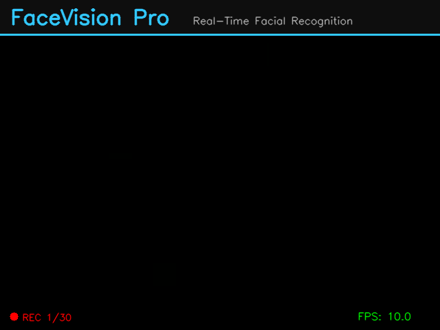

# FaceVision Pro - Real-Time Facial Recognition System

A production-quality real-time facial recognition system built with Python, OpenCV, dlib, and Keras. Features face detection, recognition, emotion analysis, and age/gender estimation through a modern web interface.



## Features

- **Real-Time Face Detection** — OpenCV DNN (SSD ResNet-10) with Haar cascade fallback
- **Face Recognition** — dlib-based 128-dimensional face encoding with configurable tolerance
- **Emotion Detection** — Keras CNN trained on FER-2013 (7 emotions: Happy, Sad, Angry, Surprise, Fear, Disgust, Neutral)
- **Age & Gender Estimation** — Caffe models for age range and gender prediction
- **Face Registration** — Multi-capture wizard with quality feedback
- **Gallery Management** — View, search, edit, and delete registered faces
- **Live Dashboard** — Real-time camera feed with face overlays, stats, and detected face cards
- **Settings Panel** — Configurable detection thresholds, recognition tolerance, and feature toggles
- **Dark Theme UI** — Modern, responsive web interface following HCI principles

## Tech Stack

| Component | Technology |
|-----------|-----------|
| Face Detection | OpenCV DNN (SSD ResNet-10) |
| Face Recognition | dlib / face_recognition |
| Emotion Detection | TensorFlow / Keras CNN |
| Age/Gender | OpenCV DNN (Caffe models) |
| Backend | Flask |
| Frontend | HTML, CSS, JavaScript |
| Database | SQLite |

## Project Structure

```
├── main.py                    # Entry point
├── server.py                  # Flask web server
├── requirements.txt           # Dependencies
├── core/
│   ├── face_detector.py       # DNN + Haar face detection
│   ├── face_recognizer.py     # Face encoding & matching
│   ├── emotion_analyzer.py    # Emotion classification
│   ├── age_gender_estimator.py # Age/gender prediction
│   └── analysis_pipeline.py   # Orchestrates all analysis
├── database/
│   ├── db_manager.py          # SQLite operations
│   ├── face_store.py          # Face encoding storage
│   └── schema.sql             # Database schema
├── gui/
│   ├── app.py                 # Main application window
│   ├── camera_view.py         # Camera feed widget
│   ├── dashboard_panel.py     # Live dashboard
│   ├── registration_panel.py  # Face registration wizard
│   ├── gallery_panel.py       # Registered faces gallery
│   ├── settings_panel.py      # Configuration panel
│   └── components/            # Reusable UI components
├── utils/
│   ├── config.py              # Configuration constants
│   ├── logger.py              # Logging setup
│   ├── image_utils.py         # Image processing helpers
│   └── model_downloader.py    # Auto-download models
├── static/
│   ├── css/style.css          # Dark theme styles
│   └── js/app.js              # Frontend logic
└── templates/
    └── index.html             # Web UI template
```

## Installation

### Prerequisites

- Python 3.10+
- CMake (`brew install cmake` on macOS)
- Webcam

### Setup

```bash
git clone https://github.com/OmerTanveerofficial/Facial-Recognition-System.git
cd Facial-Recognition-System

python3 -m venv venv
source venv/bin/activate

pip install --upgrade pip
pip install opencv-python numpy Pillow flask flask-socketio tensorflow imageio

export PATH="/opt/homebrew/bin:$PATH"
pip install dlib face-recognition
```

### Run

```bash
source venv/bin/activate
python main.py --port 5001
```

Open **http://localhost:5001** in your browser.

## Usage

1. **Dashboard** — Click "Start Camera" to see live face detection with emotion, age, and gender overlays
2. **Register Face** — Navigate to Register, start camera, capture 5 frames, enter name, and save
3. **Gallery** — View and manage all registered faces
4. **Settings** — Adjust detection confidence, recognition tolerance, and toggle features

## Architecture

```
Camera Thread (OpenCV) → Analysis Pipeline → Queue → Flask Server → Browser (MJPEG)
                              │
                    ┌─────────┼─────────┐
                    │         │         │
              Face Detect  Recognize  Emotion/Age
              (DNN SSD)    (dlib)    (Keras/Caffe)
```

- Thread-safe pipeline with mutex lock for dlib/TensorFlow
- Frame-skip optimization: full analysis every 3rd frame, tracking on intermediate frames
- Queue-based frame delivery to prevent UI blocking

## License

MIT
